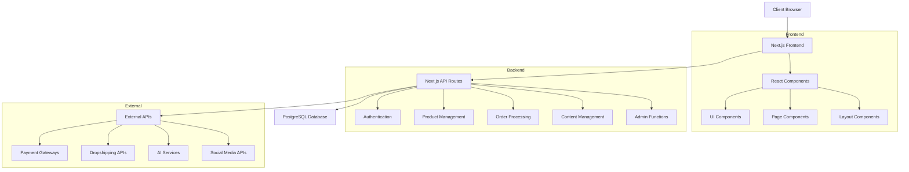
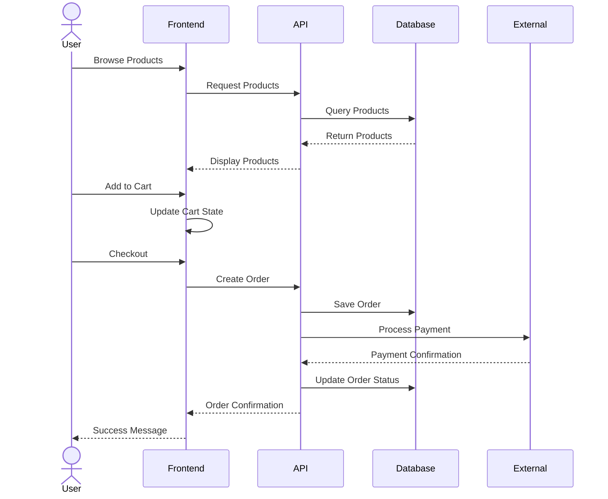
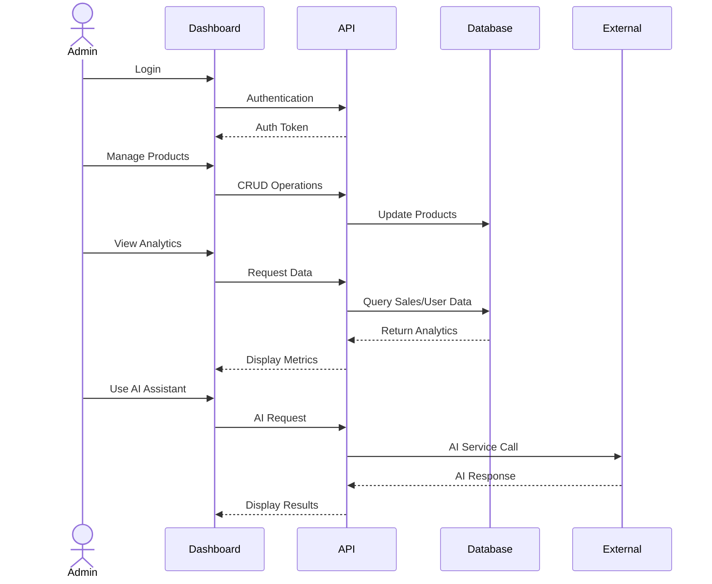

# System Patterns

## Architecture Overview

The Click Urban e-commerce platform follows a modern web application architecture using Next.js, with a clear separation of concerns between frontend and backend components.

## Key Design Patterns

### Frontend Patterns

1. **Component-Based Architecture**
   - Reusable UI components for consistent design
   - Composition pattern for building complex interfaces
   - Container/Presenter pattern for separating logic from presentation
   - Layout components (Header, Footer, MainLayout) for consistent structure

2. **Design System**
   - CSS variables for theming and consistent styling
   - Light/dark mode toggle with system preference detection
   - Responsive design with mobile-first approach
   - Utility classes for common styling patterns

3. **State Management**
   - Context API for global state (ThemeProvider)
   - Local component state for UI-specific state (menu toggle, form inputs)
   - Server state management for data fetching and caching (planned)

4. **Routing & Navigation**
   - Next.js App Router for file-based routing
   - Dynamic routes for product pages and categories
   - Middleware for authentication and route protection (planned)

### Backend Patterns

1. **API Design**
   - RESTful API endpoints for CRUD operations
   - API Routes organized by domain (products, users, orders)
   - Consistent error handling and response formatting

2. **Data Access**
   - Repository pattern with Prisma ORM
   - Data validation at API boundaries
   - Transaction management for complex operations

3. **Authentication & Authorization**
   - Token-based authentication
   - Role-based access control
   - Multi-factor authentication flow

## Core Implementation Paths

### User Journey

### Admin Journey

## Data Models

### Core Entities

1. **User**
   - Authentication details
   - Profile information
   - Roles and permissions

2. **Product**
   - Basic information (name, description, price)
   - Media (images, videos)
   - Variants (size, color, etc.)
   - Inventory status
   - Dropshipping source details

3. **Order**
   - Order items and quantities
   - Customer information
   - Payment details
   - Shipping information
   - Status tracking

4. **Content**
   - Blog posts
   - Marketing materials
   - SEO metadata

## Scalability Considerations

- Server-side rendering for performance and SEO
- Edge caching for static content
- Database indexing for query performance
- Pagination for large data sets
- Image optimization and CDN usage
