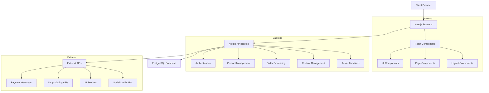
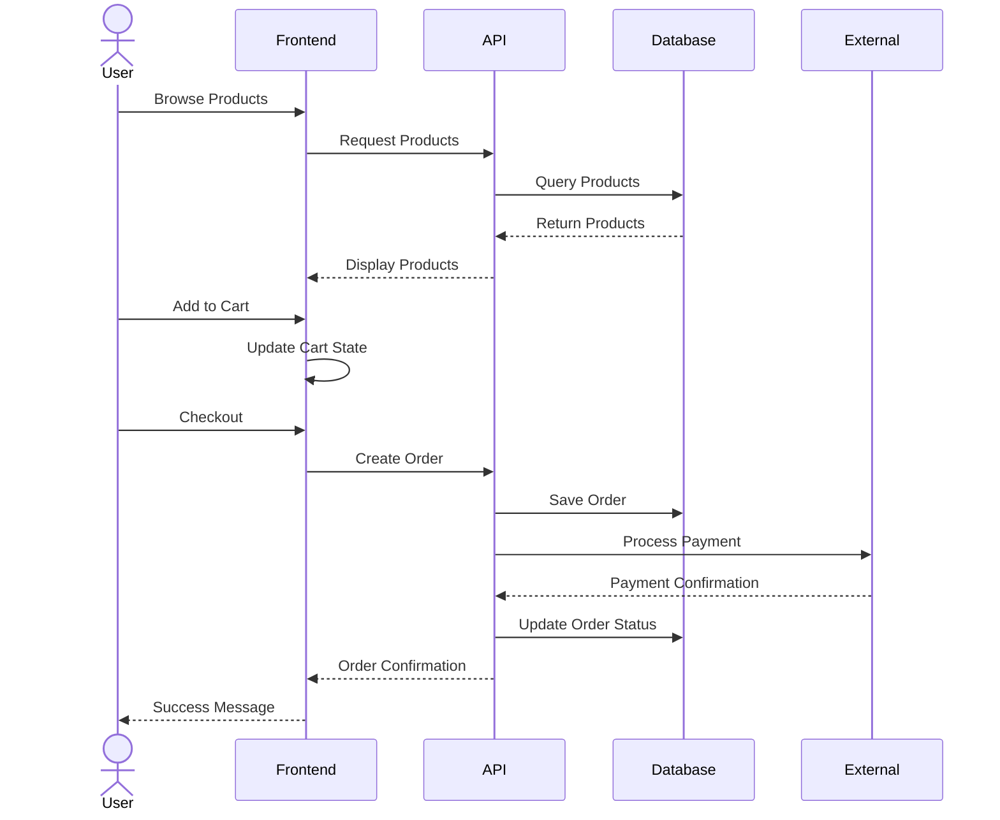
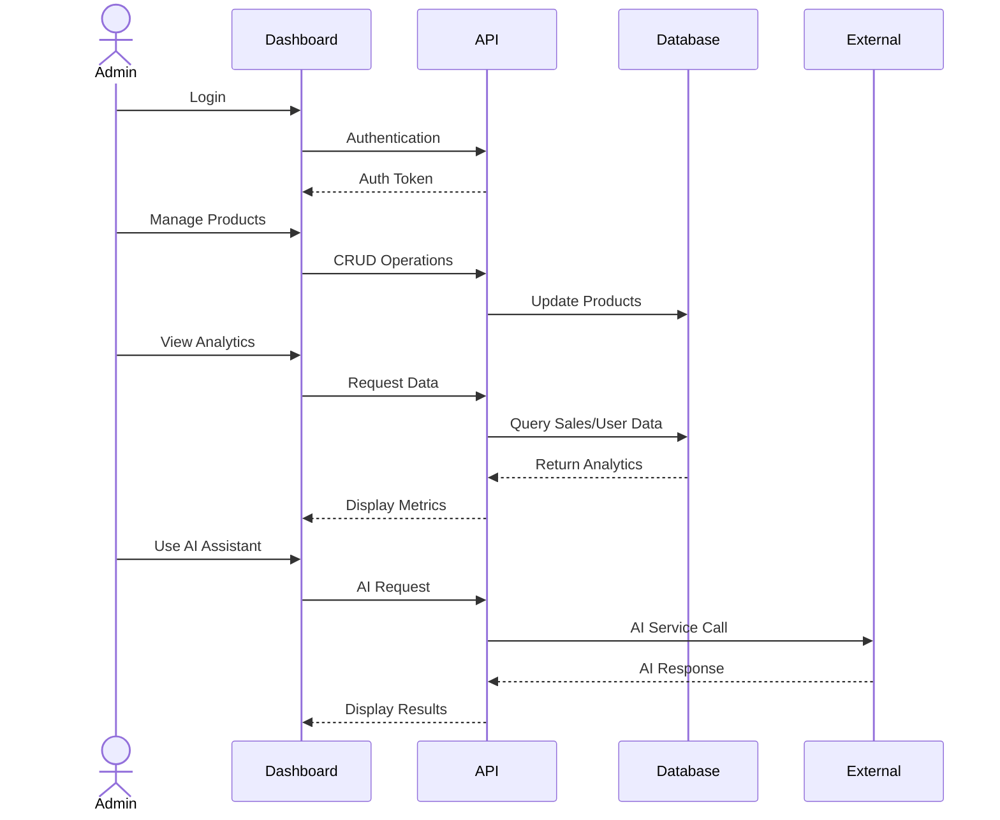

# System Patterns

## Architecture Overview

The Click Urban e-commerce platform follows a modern web application architecture using Next.js, with a clear separation of concerns between frontend and backend components.



## Key Design Patterns

### Frontend Patterns

1. **Component-Based Architecture**
   - Reusable UI components for consistent design
   - Composition pattern for building complex interfaces
   - Container/Presenter pattern for separating logic from presentation
   - Layout components (Header, Footer, MainLayout) for consistent structure

2. **Design System**
   - CSS variables for theming and consistent styling
   - Light/dark mode toggle with system preference detection
   - Responsive design with mobile-first approach
   - Utility classes for common styling patterns

3. **State Management**
   - Context API for global state (ThemeProvider)
   - Local component state for UI-specific state (menu toggle, form inputs)
   - Server state management for data fetching and caching (planned)

4. **Routing & Navigation**
   - Next.js App Router for file-based routing
   - Dynamic routes for product pages and categories
   - Middleware for authentication and route protection (planned)

### Backend Patterns

1. **API Design**
   - RESTful API endpoints for CRUD operations
   - API Routes organized by domain (products, users, orders)
   - Consistent error handling and response formatting

2. **Data Access**
   - Repository pattern with Prisma ORM
   - Data validation at API boundaries
   - Transaction management for complex operations

3. **Authentication & Authorization**
   - Token-based authentication
   - Role-based access control
   - Multi-factor authentication flow

## Core Implementation Paths

### User Journey



### Admin Journey



## Data Models

### Core Entities

1. **User**
   - Authentication details (email, password)
   - Profile information (name, image)
   - Roles and permissions (USER, ADMIN)
   - Relationship to orders and addresses
   - Timestamps for creation and updates

2. **Product**
   - Basic information (name, description, price)
   - Compare-at price for discounts
   - Media (array of image URLs)
   - Category relationship
   - Inventory status
   - Active/inactive status
   - Relationship to variants and order items
   - Timestamps for creation and updates

3. **ProductVariant**
   - Relationship to parent product
   - Variant attributes (name, value)
   - Optional override price
   - Inventory tracking
   - Cascade deletion with parent product

4. **Category**
   - Name and description
   - Image URL
   - Relationship to products
   - Timestamps for creation and updates

5. **Order**
   - Relationship to user
   - Status tracking (PENDING, PROCESSING, SHIPPED, DELIVERED, CANCELLED)
   - Total amount
   - Relationship to order items
   - Shipping and billing addresses
   - Payment details (payment intent ID, payment status)
   - Timestamps for creation and updates

6. **OrderItem**
   - Relationship to order and product
   - Quantity
   - Price at time of purchase
   - Variant information (JSON string)
   - Cascade deletion with parent order

7. **Address**
   - Relationship to user
   - Contact information (name)
   - Address details (line1, line2, city, state, postal code, country)
   - Default status flag
   - Cascade deletion with parent user

8. **Content**
   - Title and slug (unique)
   - Content body (Markdown or HTML)
   - Excerpt and featured image
   - Published status
   - Timestamps for creation and updates

### Database Schema (Prisma)

```prisma
// User model
model User {
  id            String    @id @default(cuid())
  email         String    @unique
  name          String?
  password      String?
  image         String?
  role          Role      @default(USER)
  createdAt     DateTime  @default(now())
  updatedAt     DateTime  @updatedAt
  orders        Order[]
  addresses     Address[]
}

enum Role {
  USER
  ADMIN
}

// Product model
model Product {
  id              String           @id @default(cuid())
  name            String
  description     String
  price           Float
  compareAtPrice  Float?
  images          String[]
  category        Category         @relation(fields: [categoryId], references: [id])
  categoryId      String
  inventory       Int              @default(0)
  isActive        Boolean          @default(true)
  createdAt       DateTime         @default(now())
  updatedAt       DateTime         @updatedAt
  orderItems      OrderItem[]
  variants        ProductVariant[]
}

// Product variant model
model ProductVariant {
  id          String  @id @default(cuid())
  productId   String
  product     Product @relation(fields: [productId], references: [id], onDelete: Cascade)
  name        String
  value       String
  price       Float?
  inventory   Int     @default(0)
}

// Category model
model Category {
  id          String    @id @default(cuid())
  name        String
  description String?
  image       String?
  products    Product[]
  createdAt   DateTime  @default(now())
  updatedAt   DateTime  @updatedAt
}

// Order model
model Order {
  id                String      @id @default(cuid())
  user              User        @relation(fields: [userId], references: [id])
  userId            String
  status            OrderStatus @default(PENDING)
  total             Float
  items             OrderItem[]
  shippingAddress   String?
  billingAddress    String?
  paymentIntent     String?
  paymentStatus     String?
  createdAt         DateTime    @default(now())
  updatedAt         DateTime    @updatedAt
}

enum OrderStatus {
  PENDING
  PROCESSING
  SHIPPED
  DELIVERED
  CANCELLED
}

// Order item model
model OrderItem {
  id          String  @id @default(cuid())
  order       Order   @relation(fields: [orderId], references: [id], onDelete: Cascade)
  orderId     String
  product     Product @relation(fields: [productId], references: [id])
  productId   String
  quantity    Int
  price       Float
  variantInfo String?
}

// Address model
model Address {
  id          String  @id @default(cuid())
  user        User    @relation(fields: [userId], references: [id], onDelete: Cascade)
  userId      String
  name        String
  line1       String
  line2       String?
  city        String
  state       String
  postalCode  String
  country     String
  isDefault   Boolean @default(false)
}

// Content model
model Content {
  id            String    @id @default(cuid())
  title         String
  slug          String    @unique
  content       String
  excerpt       String?
  featuredImage String?
  published     Boolean   @default(false)
  createdAt     DateTime  @default(now())
  updatedAt     DateTime  @updatedAt
}
```

## Scalability Considerations

- Server-side rendering for performance and SEO
- Edge caching for static content
- Database indexing for query performance
- Pagination for large data sets
- Image optimization and CDN usage
